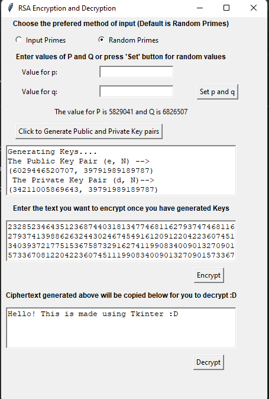

# RSA-implementation
 RSA implementation interface using Tkinter

to run the application : `python main.py`

* basic implementation of tkinter 
* we can choose random primes or enter own prime numbers
* we can encrypt and decrypt sentences

